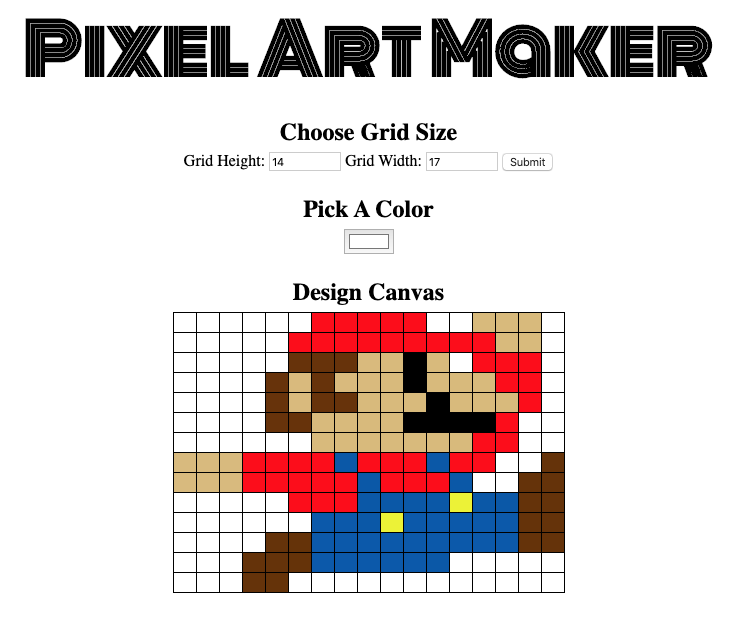

# PixelArtMaker
This project was built for the Udacity Introduction to Prorgaming Nanodegree. This project demonstrates an understanding of JavaScript event listeners.  

## Live App - https://fastalana.github.io/PixelArtMaker/

## How to Use the App
### 1. Set the canvas size using the width and height input boxes. 
	When you have selected your desired dimensions, click "submit".
### 2. Choose a color from the color picker input box.  
	You can change the color as many times as you want!
### 3. Click on any box in the grid below, to change that boxes color.
	If you want to "erase" a color, simply choose white and select the box you want to erase.
### 4. Repeat steps 2 and 3 until your design is complete.
	If you want to start over, click "submit."  This will create a new, blank grid.
### 5. Enjoy!
	Take a screen shot of your finished pixel art.

## Useful Links
**Udacity Information**

This code was a project for the Introduction to Progaming Nanodegree.  Resource links are listed below:

* [Introduction to Programming](https://www.udacity.com/course/intro-to-programming-nanodegree--nd000)
* [Starter code](https://github.com/udacity/project-pixel-art-maker-starter)
* [Rubric](https://review.udacity.com/#!/rubrics/641/view)

**Resources and Documentation**
* [MDN > EventTarget.addEventListener()](https://developer.mozilla.org/en-US/docs/Web/API/EventTarget/addEventListener)
* [MDN > HTMLTableRowElement.insertCell()](https://developer.mozilla.org/en-US/docs/Web/API/HTMLTableRowElement/insertCell)
* [MDN > HTMLTableElement.insertRow()](https://developer.mozilla.org/en-US/docs/Web/API/HTMLTableElement/insertRow)
* [MDN > ChildNode.remove()](https://developer.mozilla.org/en-US/docs/Web/API/ChildNode/remove)
* [MDN > Event.PreventDefault()](https://developer.mozilla.org/en-US/docs/Web/API/Event/preventDefault)
